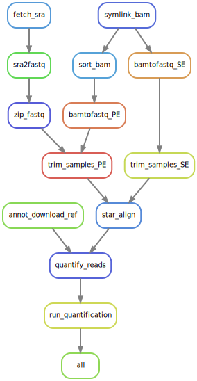

# CHO Coding Transcriptomes

This work can be reproduced by installing conda and the Snakemake environment in
`workflow/envs`.
For the analysis, install the conda environment in `workflow/envs/r.yaml` or the
corresponding "pinned", i.e. explicit environment definition file.


## File structure

The most important/interesting stuff is probably only contained in a handfull
of directories. The `workflow/` directory which includes all data processing
scripts as well as workflow definitions for Snakemake. The `analysis/` and
`results/analysis` directories contain the analysis of the data in raw R Markdown and
rendered HTML, respectively.

```
./
├── analysis/                 # (!!!) Analysis conducted in R; rendered to HTML
├── logs/                     # Logs from the data processing steps
├── plots/                    # (!!!) Plots produced in the workflow
├── reports/                  # Snakemake reports and rulegraphs
├── resources/                # Raw-data and other resources
│   ├── adapters/             # Adapters for trimming
│   └── raw_data/             # Raw-data downloaded in here
├── results/                  # Results produced in the workflow
│   └── analysis/             # (!!!) Rendered analysis reports
├── workflow/                 # (!!!) Workflow definitions
│   ├── envs/                 # Conda environments
│   ├── profile/              # Snakemake profile
│   ├── rules/                # Snakemake rules
│   ├── scripts/              # Scripts (Python, R, Bash)
│   ├── config.yaml           # Workflow config
│   └── Snakefile             # Main Snakefile
└── README.md
```

## Pipeline



### NCBI specific pre-processing workflow steps

1. Prefetch SRA files using `prefetch` utility
   ([01_preprocessing.smk](workflow/rules/01_preprocessing.smk)).
2. Convert SRA reads to .fastq.gz using `fastq-dump`
   ([01_preprocessing.smk](workflow/rules/01_preprocessing.smk)).

### In-House specific pre-processing workflow steps

1. Gather all file paths for raw data as well as metadata from in-house
   datasets using the [inhouse_data.R](workflow/scripts/inhouse_data.R) script.
2. Convert BAM files to .fastq.gz using bamtofastq
   ([01_preprocessing.smk](workflow/rules/01_preprocessing.smk)).

### General Workflow

#### Data processing

1. Quality check of reads using `fastqc`. Gather all results for each dataset
   in a `multiqc` report
   ([qc.smk](workflow/rules/qc.smk)).
2. Trimming reads using `trimmomatic`
   ([02_trimming.smk](workflow/rules/02_trimming.smk)).
3. Quality check of trimmed reads using `fastqc`. Again, gather results for
   each dataset with `multiqc`
   ([02_trimming.smk](workflow/rules/qc.smk), [qc.smk](workflow/rules/qc.smk)).
4. Align reads to the PICRH genome using `STAR`
   ([03_alignment.smk](workflow/rules/03_alignment.smk)).
5. Quantify mapped reads using `featureCounts`
   ([04_quantification.smk](workflow/rules/04_quantification.smk)).
6. Chromatin states enrichments with `chromHMM`
   ([05_chromatin-states.smk](workflow/rules/05_chromatin-states.smk)).

#### Analysis

This is mostly done in [Quarto](https://quarto.org) files. See directories
`analysis/` for `.qmd` files and `results/analysis/` for corresponding HTML
reports.
The corresponding Snakemake rules are defined in
[06_analysis.smk](workflow/rules/06_analysis.smk).

#### Figures

- **Figure 1**: [analysis/figure1.R](analysis/figure1.R)
- **Figure 2**: [analysis/figure2.R](analysis/figure2.R)
- **Figure 3**: [analysis/indeterminate-genes.R](analysis/indeterminate-genes.R)
- **Figure 4**: [analysis/figure4.R](analysis/figure4.R)
- **Figure S1**: [analysis/figureS1.R](analysis/figureS1.R)
- **Figure S2**: [analysis/figureS2.R](analysis/figureS2.R)
- **Figure S3**: [analysis/figureS3.R](analysis/figureS3.R)
- **Figure S4**: [analysis/figureS4.R](analysis/figureS4.R)
- **Figure S5**: [analysis/indeterminate-genes.R](analysis/indeterminate-genes.R)
- **Figure S6**: [analysis/figureS6.R](analysis/figureS6.R.R)
- **Figure S7**: [analysis/06_chromatin-states.qmd](analysis/06_chromatin-states.qmd)


